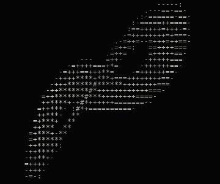

<!-- if you're reading the source, you're already past the interface. -->
<!-- connector write test -->

### Nathan Luevano

<samp>security engineering · reverse engineering · binary analysis · systems security</samp>

<em>“What I cannot create, I do not understand.”</em>  Richard P. Feynman

<samp>opcodes · executable formats · bitstreams · traces</samp>

[**quandle.xyz**](https://quandle.xyz/) · [x.com/nathanluevano](https://x.com/nathanluevano)

 
